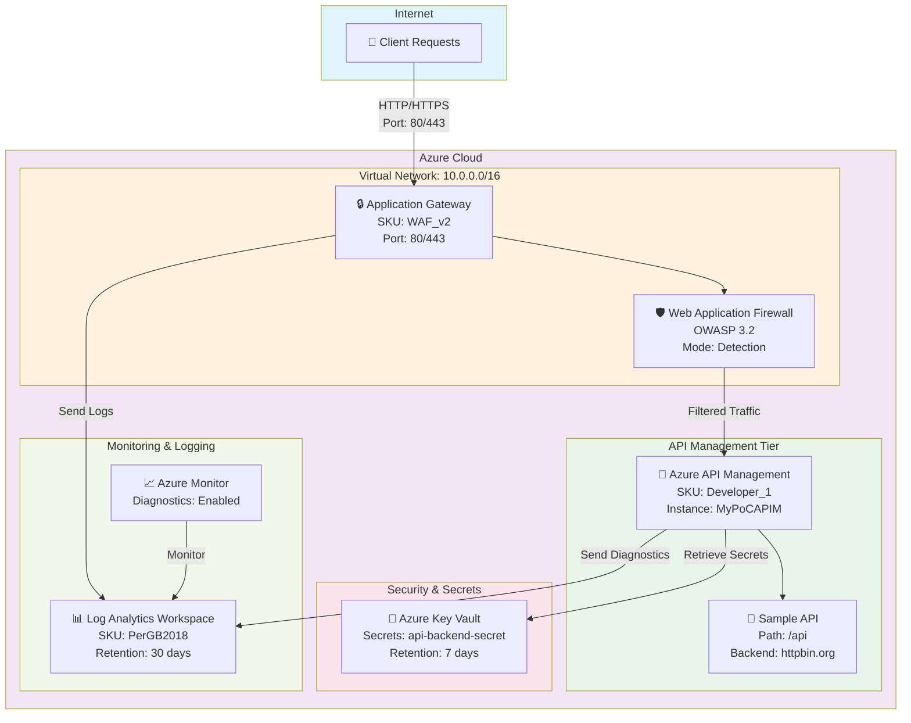
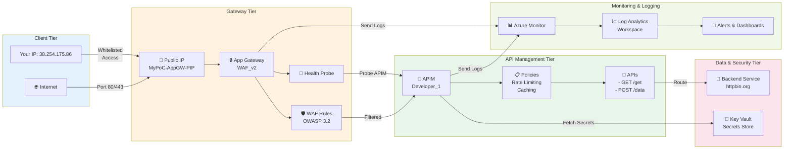
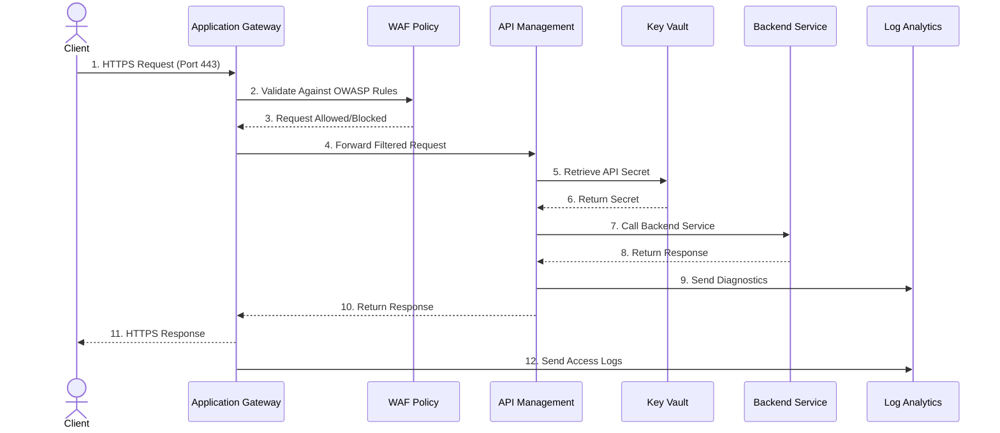

# Azure API Management PoC with DevSecOps Pipeline

This repository contains a complete Infrastructure-as-Code (IaC) setup for deploying a secure, production-ready Azure API Management (APIM) solution with Application Gateway, Web Application Firewall (WAF), Key Vault, and comprehensive monitoring using Log Analytics.

---

## 📋 Architecture Overview

### High-Level Architecture Diagram



### Detailed Component Architecture



### Data Flow Diagram



---

## 🔧 Prerequisites & Tools

Before you begin, ensure you have the following tools installed and configured:

### Required Tools

| Tool | Version | Purpose | Installation |
|------|---------|---------|--------------|
| **Terraform** | >= 1.7.0 | Infrastructure provisioning | [Download](https://www.terraform.io/downloads) |
| **Azure CLI** | >= 2.50.0 | Azure authentication & management | [Install](https://learn.microsoft.com/cli/azure/install-azure-cli) |
| **PowerShell** | >= 7.0 | Scripting & automation | [Install](https://learn.microsoft.com/powershell/scripting/install/installing-powershell) |
| **Git** | >= 2.30.0 | Version control | [Download](https://git-scm.com/downloads) |
| **tfsec** | >= 1.32.4 | Terraform static security analysis | [Install](https://github.com/aquasecurity/tfsec) |

### Optional Tools

- **Visual Studio Code** - Recommended editor with Terraform extensions
- **Azure Storage Explorer** - For inspecting Azure resources
- **Postman/curl** - For API testing

---

## 🔐 Security Setup: IP Whitelisting

Your IP has been automatically detected and should be whitelisted for access to the Azure environment.

**Your Public IP:** `38.254.175.86`

### Adding IP to Network Security Group (NSG)

To restrict access to your resources to only your IP:

```bash
# Option 1: Using Terraform (Update main.tf)
# Uncomment and update the NSG rule in the main.tf file:

resource "azurerm_network_security_rule" "allow_my_ip" {
  name                        = "AllowMyIP"
  priority                    = 100
  direction                   = "Inbound"
  access                      = "Allow"
  protocol                    = "Tcp"
  source_port_range           = "*"
  destination_port_range      = "443"
  source_address_prefix       = "38.254.175.86/32"
  destination_address_prefix  = "*"
  resource_group_name         = azurerm_resource_group.poc_rg.name
  network_security_group_name = azurerm_network_security_group.poc_nsg.name
}

# Option 2: Using Azure CLI
az network nsg rule create \
  --resource-group MyPoCRG \
  --nsg-name MyPoC-NSG \
  --name AllowMyIP \
  --priority 100 \
  --source-address-prefixes 38.254.175.86/32 \
  --destination-port-ranges 443 \
  --access Allow \
  --protocol Tcp
```

---

## 📦 Configuration Details

### Resource Configuration

| Component | Resource Type | Configuration |
|-----------|---------------|---------------|
| **Resource Group** | `azurerm_resource_group` | Name: `MyPoCRG`, Location: `East US` |
| **Virtual Network** | `azurerm_virtual_network` | CIDR: `10.0.0.0/16` |
| **App Gateway Subnet** | `azurerm_subnet` | CIDR: `10.0.1.0/24` |
| **Application Gateway** | `azurerm_application_gateway` | SKU: `WAF_v2`, Capacity: 1 |
| **WAF Policy** | WAF Configuration | Mode: `Detection`, Rule Set: `OWASP 3.2` |
| **API Management** | `azurerm_api_management` | SKU: `Developer_1`, Name: `MyPoCAPIM` |
| **Key Vault** | `azurerm_key_vault` | SKU: `Standard`, Retention: 7 days |
| **Log Analytics** | `azurerm_log_analytics_workspace` | SKU: `PerGB2018`, Retention: 30 days |

### Variables (terraform.tfvars)

```hcl
resource_group_name    = "MyPoCRG"
location               = "East US"
vnet_name              = "MyPoC-VNet"
appgw_subnet_name      = "AppGatewaySubnet"
log_analytics_name     = "MyPoC-LogAnalytics"
key_vault_name         = "mypoc-keyvault-001"
apim_name              = "MyPoCAPIM"
api_id                 = "mybasicapi"
api_name               = "My Basic API"
api_path               = "api"
service_url            = "https://httpbin.org"
appgw_public_ip_name   = "MyPoC-AppGW-PIP"
certificate_pfx_path   = ""              # Leave empty for HTTP fallback
certificate_password   = "PfxPassword123!"
```

---

## 🚀 Deployment Steps

### Step 1: Initialize Terraform

Initialize the Terraform working directory and download the required Azure provider:

```bash
cd c:\Users\sreek\IdeaProjects\test

# Initialize Terraform
terraform init

# Optionally, validate the configuration
terraform validate

# Format the configuration (best practice)
terraform fmt -recursive
```

### Step 2: Review the Deployment Plan

Generate a plan to see what resources will be created:

```bash
terraform plan -out=tfplan
```

**Expected Output:** Plan should show 13 resources to be added.

### Step 3: Apply the Configuration

Deploy the infrastructure to Azure:

```bash
# Automatic approval (for CI/CD pipelines)
terraform apply -auto-approve

# OR interactive approval (recommended for manual runs)
terraform apply tfplan
```

**Deployment Time:** Approximately 10-15 minutes

### Step 4: Retrieve Outputs

After successful deployment, retrieve the resource endpoints:

```bash
terraform output

# To get a specific output:
terraform output apim_gateway_url
terraform output app_gateway_public_ip
terraform output log_analytics_workspace_id
```

---

## 🔄 DevSecOps Pipeline

This repository includes a GitHub Actions CI/CD pipeline for automated testing, security scanning, and deployment.

### Pipeline Workflow

**Trigger:** Push to `main` branch or Pull Request

#### Stage 1: Validation & Security Scanning

```bash
# Steps executed on every commit:
1. Checkout repository
2. Set up Terraform 1.7.0
3. Install tfsec (security scanner)
4. Terraform Format Check (terraform fmt -check)
5. Terraform Validate (terraform validate)
6. Terraform Static Analysis (tfsec .)
```

#### Stage 2: Planning

```bash
7. Azure CLI Login (using GitHub Secrets)
8. Terraform Plan (generate tfplan)
```

#### Stage 3: Deployment (only on main branch)

```bash
9. Terraform Apply (deploy infrastructure)
```

### GitHub Secrets Configuration

Configure these secrets in your GitHub repository settings:

```
Settings > Secrets and variables > Actions > New repository secret
```

**Required Secret: `AZURE_CREDENTIALS`**

Format (JSON):
```json
{
  "clientId": "YOUR_CLIENT_ID",
  "clientSecret": "YOUR_CLIENT_SECRET",
  "subscriptionId": "YOUR_SUBSCRIPTION_ID",
  "tenantId": "YOUR_TENANT_ID"
}
```

#### How to Generate Azure Credentials

```bash
# Using Azure CLI
az ad sp create-for-rbac --name "github-actions-sp" --role Contributor --scopes /subscriptions/{subscriptionId}

# Output will contain the credentials needed for AZURE_CREDENTIALS secret
```

### Local Pipeline Execution

To manually run the pipeline steps locally:

```bash
# 1. Format Check
terraform fmt -check -recursive

# 2. Validate
terraform validate

# 3. Security Scanning (tfsec)
tfsec .

# 4. Plan
terraform plan -out=tfplan

# 5. Apply
terraform apply tfplan
```

---

## 📊 Monitoring & Logging

### View Deployment Logs

#### 1. Using Azure Portal

```
Azure Portal > Resource Groups > MyPoCRG > Activity Log
```

#### 2. Using Azure CLI

```bash
# Get resource group activity log
az monitor activity-log list \
  --resource-group MyPoCRG \
  --max-records 50

# Get APIM diagnostic logs
az monitor log-analytics query \
  --workspace MyPoC-LogAnalytics \
  --analytics-query "AzureDiagnostics | where ResourceProvider == 'MICROSOFT.APIMANAGEMENT'"
```

### Querying Log Analytics

#### View APIM Gateway Logs

```kql
AzureDiagnostics
| where ResourceProvider == "MICROSOFT.APIMANAGEMENT"
| where Category == "GatewayLogs"
| project TimeGenerated, OperationName, Message, statusCode_s
| limit 100
```

#### View App Gateway Access Logs

```kql
AzureDiagnostics
| where ResourceProvider == "MICROSOFT.NETWORK"
| where ResourceType == "APPLICATIONGATEWAYS"
| where Category == "ApplicationGatewayAccessLog"
| project TimeGenerated, clientIP_s, httpStatus_d, backendStatus_d, timeTaken_d
| limit 100
```

#### View WAF Logs

```kql
AzureDiagnostics
| where ResourceProvider == "MICROSOFT.NETWORK"
| where Category == "ApplicationGatewayFirewallLog"
| project TimeGenerated, action_s, Message, clientIP_s, ruleSetType_s
| limit 100
```

#### View Key Vault Access Logs

```kql
AzureDiagnostics
| where ResourceProvider == "MICROSOFT.KEYVAULT"
| where OperationName != "authenticate"
| project TimeGenerated, OperationName, clientIP_s, httpStatusCode_d
| limit 100
```

#### Create Log Analytics Dashboard (via CLI)

```bash
# Create an alert for failed authentication attempts
az monitor metrics alert create \
  --name "KeyVaultAuthFailures" \
  --resource-group MyPoCRG \
  --scopes /subscriptions/{subscriptionId}/resourceGroups/MyPoCRG/providers/Microsoft.KeyVault/vaults/mypoc-keyvault-001 \
  --condition "total AuthenticationFailures > 5" \
  --window-size 5m \
  --evaluation-frequency 1m
```

---

## 🛡️ Security Best Practices

### 1. Certificate Management (HTTPS)

To enable HTTPS on the Application Gateway:

```bash
# Generate a self-signed certificate (for testing)
openssl req -x509 -newkey rsa:2048 -keyout key.pem -out cert.pem -days 365 -nodes

# Convert to PFX format
openssl pkcs12 -export -in cert.pem -inkey key.pem -out certificate.pfx -name "MyPoC"

# Update terraform.tfvars
certificate_pfx_path = "./certificate.pfx"

# Reapply
terraform apply -auto-approve
```

### 2. Key Vault Secrets

Retrieve secrets stored in Key Vault:

```bash
# List all secrets
az keyvault secret list --vault-name mypoc-keyvault-001

# Get a specific secret
az keyvault secret show --vault-name mypoc-keyvault-001 --name api-backend-secret

# Add a new secret
az keyvault secret set \
  --vault-name mypoc-keyvault-001 \
  --name my-new-secret \
  --value "SecretValue123"
```

### 3. APIM API Key Management

```bash
# Get APIM resource
apim_resource=$(az apim show --name MyPoCAPIM --resource-group MyPoCRG)

# Generate a subscription key
az apim subscription create \
  --resource-group MyPoCRG \
  --service-name MyPoCAPIM \
  --display-name "MySubscription" \
  --product-id mybasicapi
```

---

## 🧪 Testing the Deployment

### Test API via curl

```bash
# Get the APIM gateway URL
APIM_URL=$(terraform output -raw apim_gateway_url)

# Test the sample API endpoint
curl -X GET \
  "${APIM_URL}/api/get" \
  -H "Content-Type: application/json"

# Using Application Gateway public IP
APP_GW_IP=$(terraform output -raw app_gateway_public_ip)
curl -X GET \
  "http://${APP_GW_IP}/api/get" \
  -H "Host: $(terraform output -raw apim_gateway_url | sed 's|https://||')"
```

### Verify Resources in Azure

```bash
# List all resources in the resource group
az resource list --resource-group MyPoCRG --output table

# Verify APIM instance
az apim show --name MyPoCAPIM --resource-group MyPoCRG

# Check Application Gateway
az network application-gateway show --name MyPoC-AppGateway --resource-group MyPoCRG

# Verify Log Analytics workspace
az monitor log-analytics workspace show --workspace-name MyPoC-LogAnalytics --resource-group MyPoCRG
```

---

## 🔄 Managing the Infrastructure

### Update Configuration

```bash
# Edit terraform.tfvars or main.tf
# Then run:
terraform plan
terraform apply
```

### Destroy Resources (Cleanup)

```bash
# Remove all provisioned resources
terraform destroy

# Or destroy specific resources
terraform destroy -target=azurerm_api_management.poc_apim
```

### Backup Terraform State

```bash
# Copy the state file
Copy-Item terraform.tfstate terraform.tfstate.backup

# Or use remote state (recommended for production)
# Configure Azure Storage for remote state:
terraform init -backend-config="storage_account_name=mystate" \
               -backend-config="container_name=tfstate" \
               -backend-config="key=prod.tfstate" \
               -backend-config="access_key=YOUR_KEY"
```

---

## 📈 Performance Monitoring

### Monitor APIM Throttling

```kql
AzureDiagnostics
| where ResourceProvider == "MICROSOFT.APIMANAGEMENT"
| where Category == "GatewayLogs"
| where Message contains "429"
| summarize Count=count() by bin(TimeGenerated, 5m)
```

### Track API Response Times

```kql
AzureDiagnostics
| where ResourceProvider == "MICROSOFT.APIMANAGEMENT"
| where Category == "GatewayRequests"
| project TimeGenerated, ResponseTime=tonumber(totalTime_d), StatusCode=statusCode_s
| summarize AvgResponseTime=avg(ResponseTime), MaxResponseTime=max(ResponseTime) by bin(TimeGenerated, 1m)
```

---

## 🐛 Troubleshooting

### Common Issues

#### 1. **Terraform State Lock**

```bash
# If state is locked, force unlock
terraform force-unlock <LOCK_ID>

# Or remove lock file
Remove-Item .terraform.tfstate.lock.info
```

#### 2. **Azure Authentication Failed**

```bash
# Re-authenticate with Azure
az login

# Verify subscription
az account show
```

#### 3. **Application Gateway Taking Time**

```bash
# Check deployment status
az network application-gateway show --name MyPoC-AppGateway --resource-group MyPoCRG

# Check network health probe
az network application-gateway probe show --name "probe" --gateway-name MyPoC-AppGateway --resource-group MyPoCRG
```

#### 4. **Certificate Error**

```bash
# Verify certificate format
openssl pkcs12 -info -in certificate.pfx

# Regenerate if needed
openssl pkcs12 -export -in cert.pem -inkey key.pem -out certificate.pfx -name "MyPoC"
```

---

## 📞 Support & Documentation

- **Terraform Docs:** https://registry.terraform.io/providers/hashicorp/azurerm/latest/docs
- **Azure APIM:** https://learn.microsoft.com/azure/api-management/
- **Application Gateway:** https://learn.microsoft.com/azure/application-gateway/
- **Log Analytics:** https://learn.microsoft.com/azure/azure-monitor/logs/
- **GitHub Actions:** https://docs.github.com/actions

---

## 📄 License

This project is provided as-is for demonstration purposes.

---

## 👥 Author

Created for Azure API Management PoC with DevSecOps Integration

**Last Updated:** April 2026
